# "ISEF" / "Jugend forscht": radiosonde project

**This project won first award and the Craig R. Barrett Award for Innovation at "Regeneron ISEF”, the world's largest student sience competition. In addition, the project won the national prize at "Jugend forscht”, Germany's largest youth science competition. [Around the World in Eighty Days: Small Radiosondes on a Great Mission](https://abstracts.societyforscience.org/Home/FullAbstract?ProjectId=21789)**

**See https://dl9as.github.io/ for more balloon flight information**

**Developer contact: DL9AS@qsl.net**

---

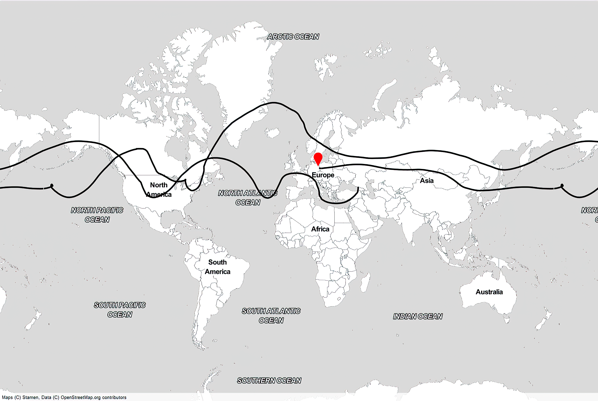

### 4th radiosonde version:

| front view                                              | back view                                             |
| ------------------------------------------------------- | ----------------------------------------------------- |
| 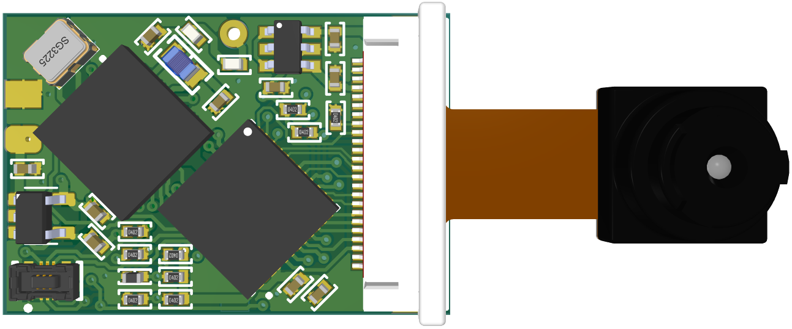 | 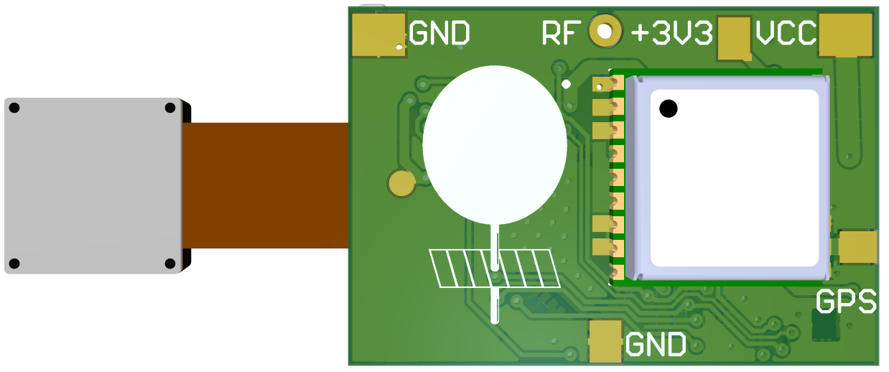 |

**Figure** - radiosonde-4

### 

| 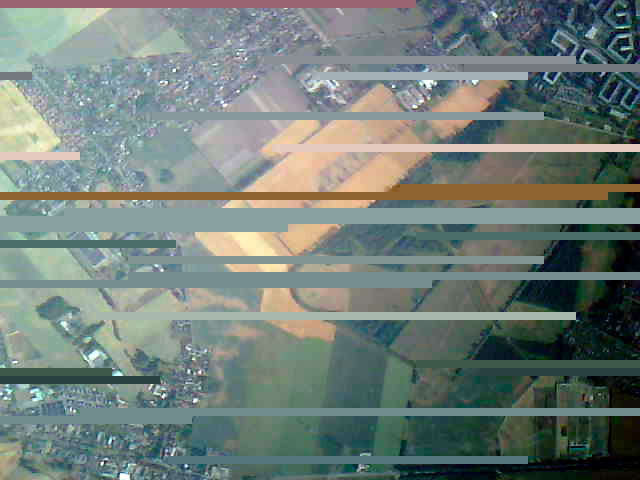 | 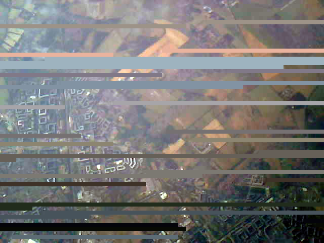 |
| --------------------------------------------------------------- | ------------------------------------------------------------------- |
| 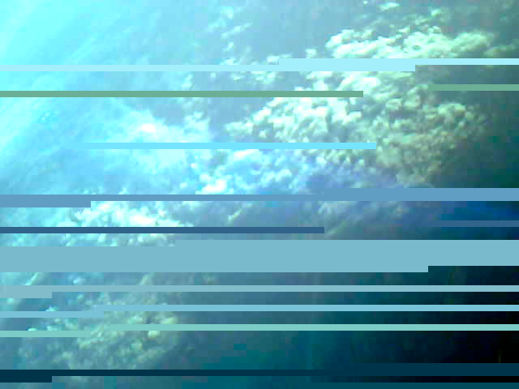 | 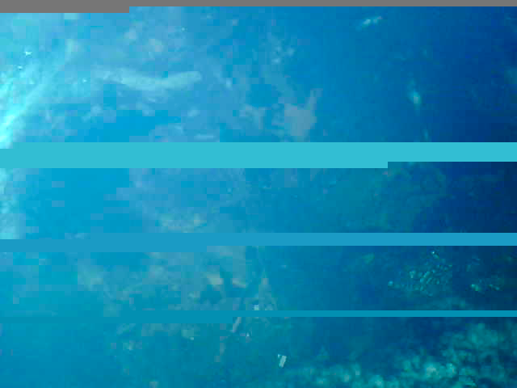 |

**Figure** - radiosonde-4 images

### 3rd radiosonde version:

| front view                                              | back view                                             |
| ------------------------------------------------------- | ----------------------------------------------------- |
| 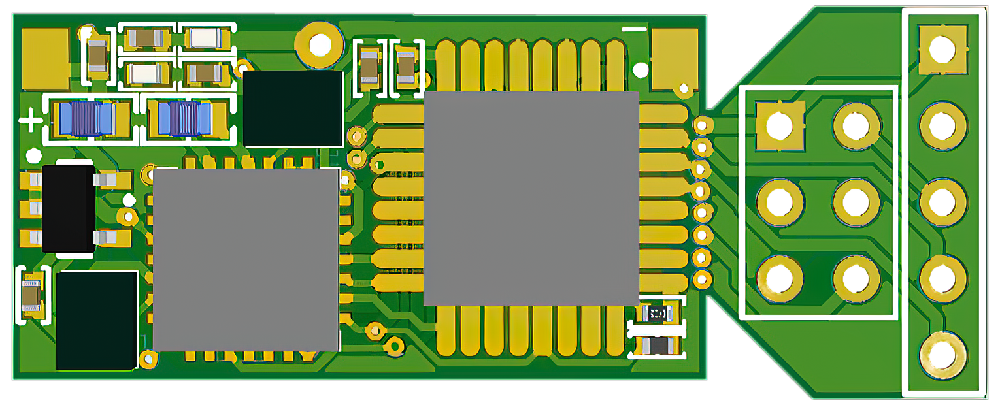 | 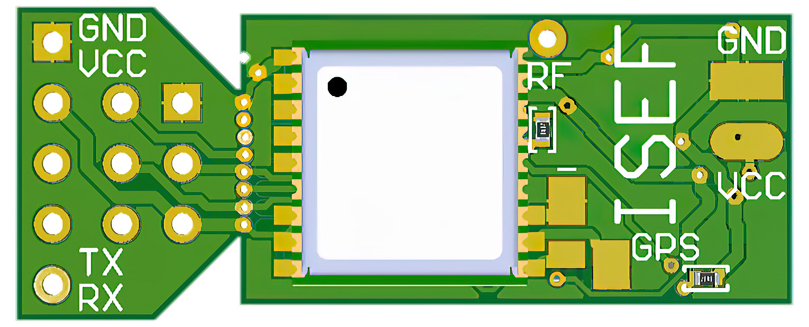 |

**Figure** - radiosonde-3

**Figure** - radiosonde-3 with mounted solar panels - weighs only 4.8 g

### 2nd radiosonde version with camera:

| aerial image                                                                                  | radiosonde with camera                                                                               |
|:---------------------------------------------------------------------------------------------:|:----------------------------------------------------------------------------------------------------:|
| 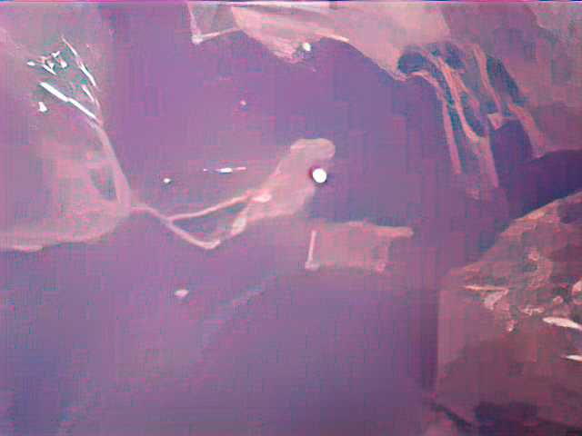 |  |

### 2nd radiosonde version:

| front view                                                                    | back view                                                                   |
| ----------------------------------------------------------------------------- | --------------------------------------------------------------------------- |
| 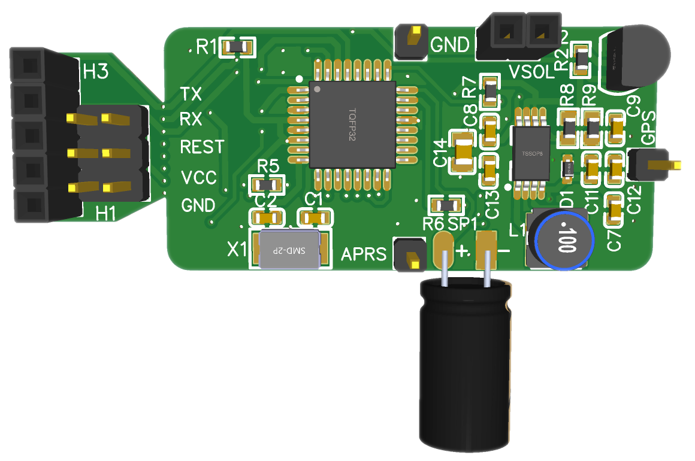 | 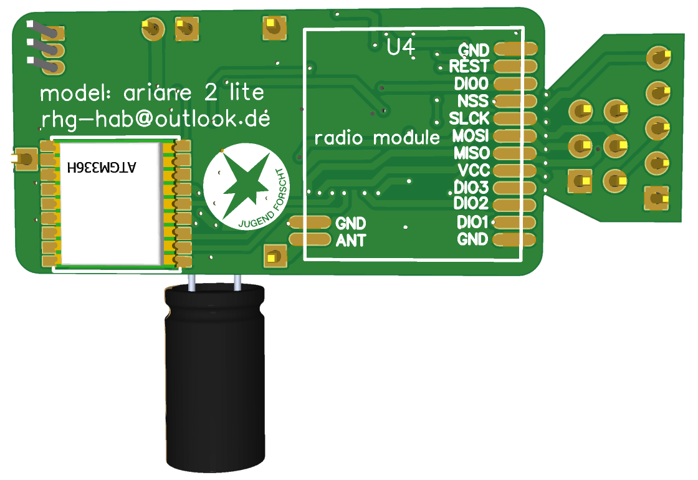 |

 **Figure** - radiosonde-2-lite pcb

 **Figure** - radiosonde-2-lite without mounted solar panels

**Figure** - radiosonde-2-lite pcb breakout

**Figure** - radiosonde-2-lite solar panels

**Figure** - radiosonde-2-lite with mounted solar panels - radiosonde-2-lite weighs only 7.8 g

**Figure** - radiosonde-2-lite with mounted solar panels from above

### 1st radiosonde version:

| front view                                                          | back view                                                         |
| ------------------------------------------------------------------- | ----------------------------------------------------------------- |
| 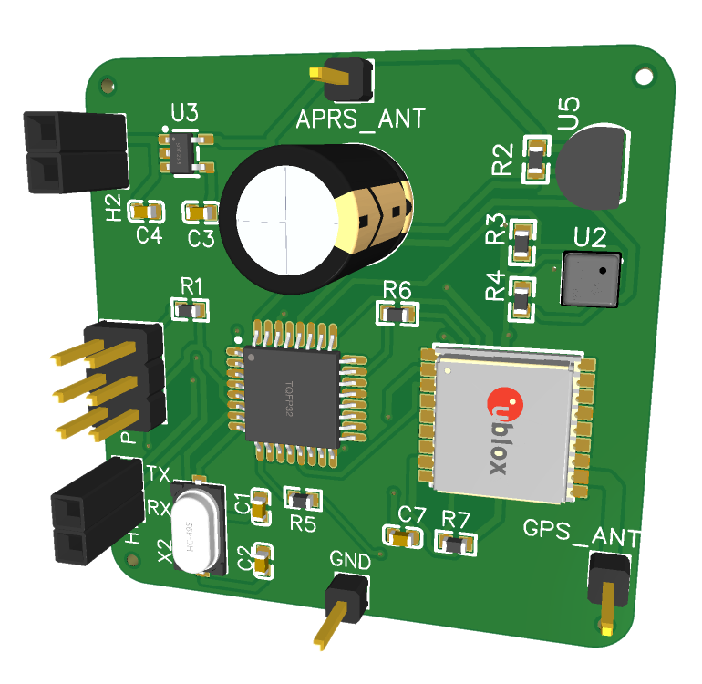 | 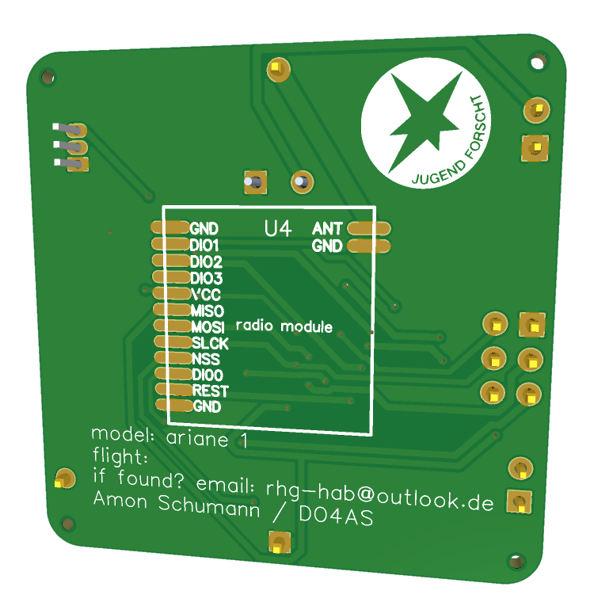 |

 **Figure** - radiosonde-1 pcb

**Figure** - radiosonde-1 with mounted solar panels

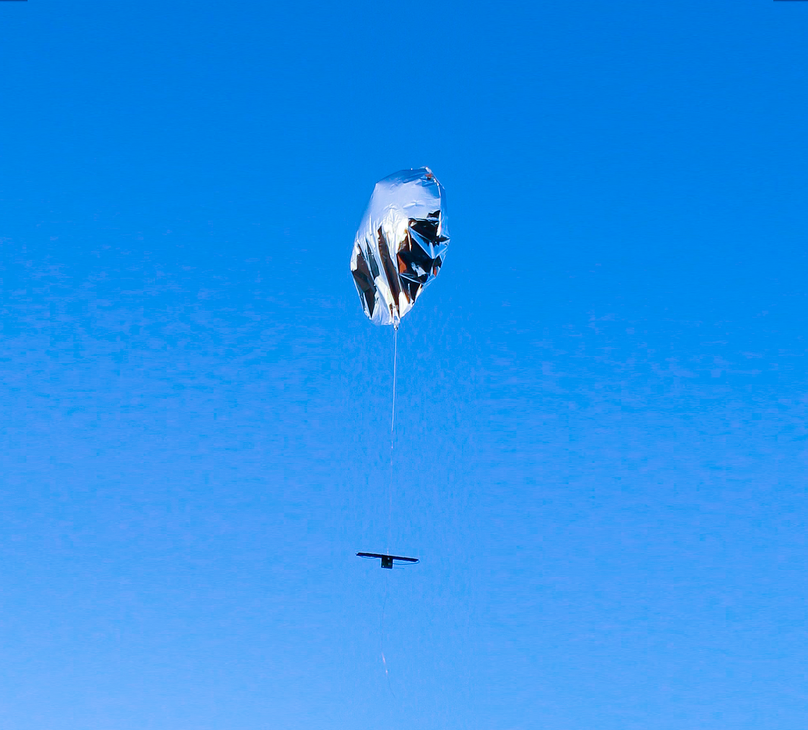

**Figure** - radiosonde-1 in the air

### APRS packet description:

 **Figure** - APRS packet description